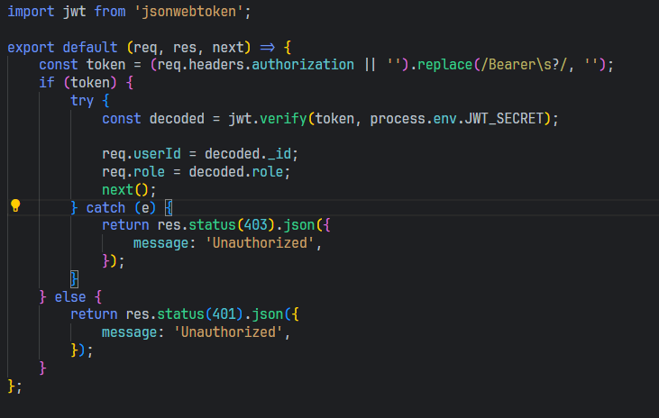

# Backend

## 📚 Table of Contents
- [🔧 Backend](#backend)
    - [🚦 Routers](#-routers)
    - [👥 User Endpoints](#-user-endpoints)
    - [🏷️ Category Endpoints](#-category-endpoints)
    - [📦 Product Endpoints](#-product-endpoints)
    - [🛍️ Order Endpoints](#-order-endpoints)
    - [⭐ Favorites Endpoints](#-favorites-endpoints)
    - [👮 User Management Endpoints](#-user-management-endpoints)
    - [📄 Models](#-models)
    - [🔐 Middleware](#-middleware)
    - [🏃 Running the Backend](#-running-the-backend)

## 🔧 Backend
Backend was built with Node and Express as main technologies (Without typescript)

Structure of folders:


### 🚦 Routers
Routers are located in `routers` folder. Each router is a separate file. All routers are imported in `routers/index.js` file and then exported to `app.js` file.

Routers are separated by entities. For example, `userRouter.js` contains all routes related to user entity.

All routers wrapped in /api path.

### 👥 User Endpoints

- `POST /api/api/auth/register`: Register a new user. The request body should include `username`, `password`, and `email`.
- `POST /api/auth/login`: Log in a user. The request body should include `username` and `password`.
- `GET /api/auth/me`: (auth) Get the current user's information. The `authorization` header should include the user's token.

### 🏷️ Category Endpoints

- `GET /api/category`: Get all categories.
- `GET /api/category/:id`: Get a category by ID.
- `POST /api/category`: (admin) Create a new category. The request body should include `name`.
- `PUT /api/category/:id`: (admin) Update a category by ID. The request body should include `name`.
- `DELETE /api/category/:id`: (admin) Delete a category by ID.

### 📦 Product Endpoints

- `GET /api/products`: Get all products. You can filter the products by category, order them, filter them by a specific field, or search for a product by name. The query parameters are `category`, `orderBy`, `filterBy`, and `searchTerm`.
- `GET /api/products/:id`: Get a product by ID.
- `POST /api/products`: (admin) Create a new product. The request body should include `name`, `description`, `price`, `imageUrl`, and `category`. The `name` should be at least 3 characters long. The `price` should be a number between 0 and 100000
- `PUT /api/products/:id`: (admin) Update a product by ID. The request body should include `name`, `description`, `price`, `imageUrl`, and `category`.
- `DELETE /api/products/:id`: (admin) Delete a product by ID. This endpoint requires authentication and admin privileges.

Note: Endpoints that modify the product (POST, PUT, DELETE) also require admin privileges.

### 🛍️ Order Endpoints

- `GET /api/orders`: (auth) Get all orders for the current user.
- `POST /api/orders/:productId`: (auth) Add a product to the current order. The request body should include `quantity`. If the last order has status `pending`, the product is added to it. Otherwise, a new order is created.
- `PUT /api/orders/:orderId/confirm`: (auth) Confirm an order. The request body should include `login` and `password`.
- `DELETE /api/orders/:orderId/:productId`: (auth) Remove a product from an order.
- `GET /api/orders/all`: (admin) Get all orders .
- `GET /api/orders/:id`: (admin) Get an order by ID.
- `PUT /api/orders/:orderId`: (admin) Update an order by ID . The request body can include `status` and `isPaid`.
- `PUT /api/orders/:orderId/:productId`: (auth) Update the quantity of a product in an order. The request body should include `quantity`.
- `DELETE /api/orders/:orderId`: (admin) Delete an order by ID .

Note: All endpoints require authentication. Some endpoints also require admin privileges.

### ⭐ Favorites Endpoints

- `GET /api/favorites`: (auth) Get all favorite products for the current user.
- `POST /api/favorites/:productId`: (auth) Add a product to the user's favorites. The `productId` is required in the URL parameters.
- `DELETE /api/favorites/:productId`: (auth) Remove a product from the user's favorites. The `productId` is required in the URL parameters.

Note: All endpoints require authentication.
### 👤 User Management Endpoints

- `GET /api/users`: (admin) Get all users.
- `DELETE /api/users/:userId`: (admin) Delete a user. The `userId` is required in the URL parameters.
- `PUT /api/users/role/:userId`: (admin) Update a user's role. The `userId` is required in the URL parameters and the new `role` should be included in the request body.

Note: All endpoints require authentication and admin privileges.

### 📄 Models

#### 👥 User

The User model has the following fields:

- `name`: A required string.
- `email`: A required string that must be unique.
- `passwordHash`: A required string.
- `avatarUrl`: A string that defaults to null.
- `role`: A string that defaults to 'user'. The possible values are defined in the `roles` object.

#### 🏷️ Category

The Category model has the following fields:

- `name`: A required string.

When a Category document is removed, the `pre remove` hook removes the reference to the category from all products that reference it.

#### 🛍️ Order

The Order model has the following fields:

- `login`: A string that is not required. It is used to confirm an order. It should be the user's username in game.
- `password`: A string that is not required. It is used to confirm an order. It should be the user's password in game.
- `user`: A required ObjectId that references a User document.
- `products`: An array of objects. Each object has a `product` field that is an ObjectId referencing a Product document and a `quantity` field that defaults to 1.
- `status`: A string that defaults to 'pending'. The possible values are defined in the `statusNames` object.
- `isPaid`: A boolean that defaults to false.

#### ⭐ Favorites

The Favorites model has the following fields:

- `user`: A required ObjectId that references a User document.
- `product`: A required ObjectId that references a Product document.

The Favorites model has a compound index on the `user` and `product` fields.

#### 📦 Product

The Product model has the following fields:

- `name`: A required string that must be unique.
- `description`: A string that is not required.
- `price`: A required number.
- `imageUrl`: A string that is not required.
- `category`: An ObjectId that references a Category document. It defaults to null.

When a Product document is removed, the `pre remove` hook removes all favorites that reference the product and removes the product from all orders that contain it.
### 🛡️ Middleware

#### 🔐 Authentication/Authorization Middleware

Authentication is implemented using JWT tokens. The token is sent in the `authorization` header. The token is generated when the user logs in or registers. The token is verified using the `jsonwebtoken` package. The token contains the user's ID and role. The role is used to restrict access to certain endpoints. For example, only admins can delete users.

##### 🧾 checkAuth

This middleware function checks if the request has a valid JWT token in the `authorization` header. If the token is valid, it decodes the token to get the user's ID and role and attaches them to the request object. If the token is not valid or not present, it sends a 401 or 403 status code with a message 'Unauthorized'.



##### 🚫 checkAdmin

This middleware function checks if the authenticated user has an admin role. If the user is an admin, it calls the next middleware function. If the user is not an admin, it sends a 403 status code with a message 'Allowed only for admin'.


## 🏃‍♂️ Running the Backend

To run the backend, first install the necessary dependencies:

```bash
npm install
```

Then, start the server:

```bash
npm start
```

The server will be running at [http://localhost:8000](http://localhost:8000)
by default (the port can be changed using the `PORT` environment variable).

## 🌍 Environment Variables

- `PORT`: The port on which the server will run. Defaults to `7777`.
- `DBCONN_STRING`: The URI of the MongoDB database. REQUIRED
- `JWT_SECRET`: The secret used to sign JWT tokens. REQUIRED
