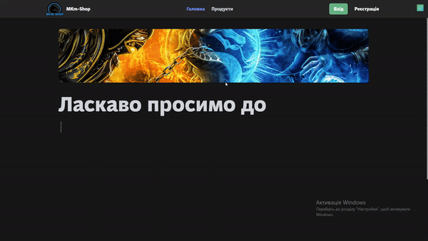
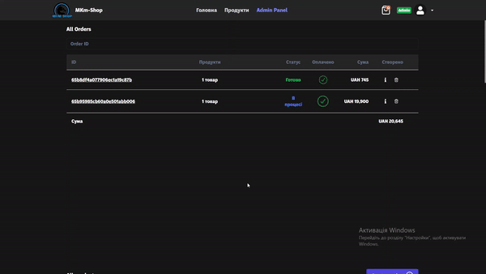
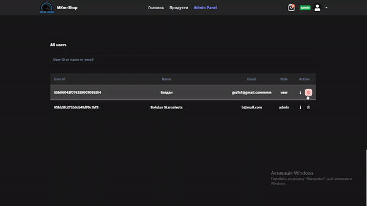
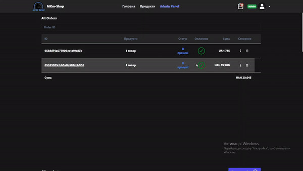
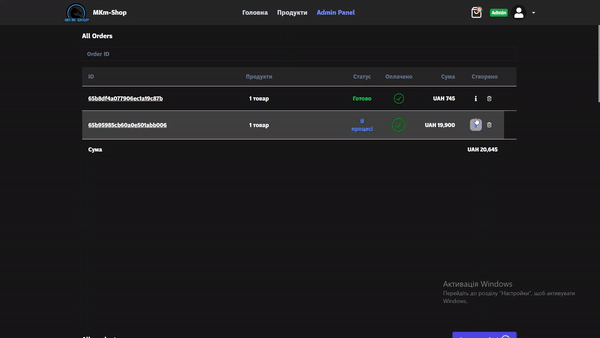
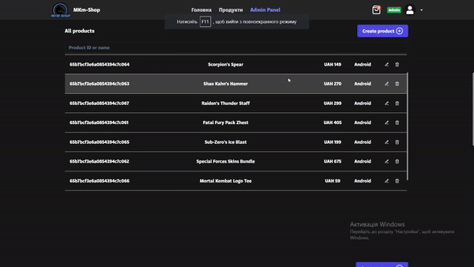
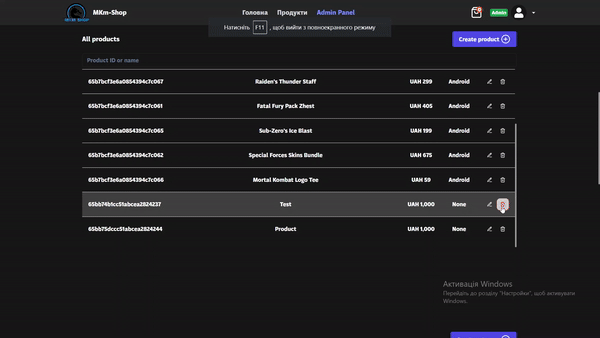
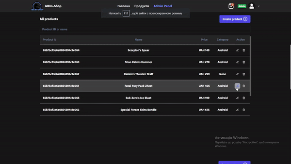
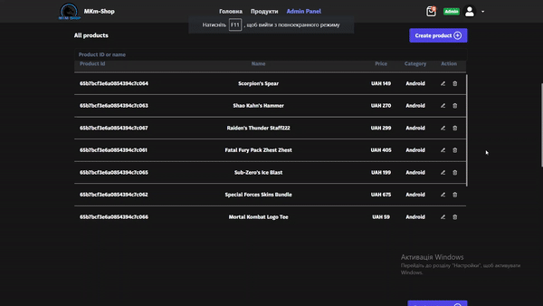

# Frontend

## 📚 Table of Contents
- [🖥️ Frontend](#-frontend)
    - [🏠 Landing page](#-landing-page)
    - [🔝 Navigation bar](#-navigation-bar)
    - [📦 Products Page](#-products-page)
    - [🔍 Product Detail](#-product-detail)
    - [🔐 Authentication Page](#-authentication-page)
    - [👤 User Profile](#-user-profile)
    - [🛒 Cart](#-cart)
    - [✅ Confirmation Order](#-confirmation-order)
    - [🏃‍♂️ Running the Frontend](#-running-the-frontend)

## 🖥️ Frontend

Frontend was built with React, TypeScript and Tailwind CSS

### 🏠 Landing page

The landing page contains these elements:

- Navigation bar with links to other pages and Authorization
- Description of the game store



### 🔝 Navigation bar

- When clicking on the logo, the user is redirected to the landing page
- When clicking on the links, the user is redirected to the corresponding page
- When clicking on the login or register button, the user gets prompted with a modal window to login or register

### 📦 Products Page

- Route: "/products"
- Authentication is required to add to cart or favorites products


### 🔍 Product Detail

- Route: "/products/:productID"
- The name and full description before it is shown, also here you can add a product to your cart too


### 🔐 Authentication Page

- Route: "/auth"
- Provides two variants of the form (login and registration)
- Users can change the form by clicking on a button below the header or manually by changing search parameters with `?variant=<"login" or "register">`.
- Performs validation with Zod schema.
- Password length must be more than 5 characters.
- Name must be at least 2 characters


### 👤 User Profile

- Route: "/me"
- Authentication Required.
- Allows users to change their name, email and avatar.
- Allows users to add to cart and favorites products


### 🛒 Cart

- Without route
- Authentication Required
- Allows users to add to cart products


### ✅ Confirmation Order

- Without route
- Authentication Required
- Allows users to confirm their order
- After confirmation, order changes status to "confirmed"


### 👮‍♂️ Admin Panel
- Route: "/admin". Authentication and admin role in the token are required.
- The admin panel is a powerful feature that allows users with the admin role to manage various aspects of the application.



#### 🚀 Admin panel allows to manage users

##### 🔄 Admin can change user's role
Admins have the ability to change the role of a user. Note: When the role of a user gets changed, they will need to log in again to see the changes because the token needs to be updated.


##### 🗑️ Admin can delete users
Admins can remove users from the system, providing a way to manage who has access to the application.



#### 📦 Admin panel allows to manage orders

##### 🔄 Admin can change order's status and isPaid status
Admins can update the status of orders, including whether or not the order has been paid for. This helps keep track of order fulfillment.



##### 🗑️ Admin can delete order's products
Admins can remove products from orders, providing flexibility in order management.



#### 🛍️ Admin panel allows to manage products

##### ➕ Admin can create products
Admins can add new products to the application, allowing for the introduction of new items for purchase.



##### 🗑️ Admin can delete products
Admins can remove products from the application, providing a way to manage the available inventory.



##### 🔄 Admin can change products
Admins can update product details, allowing for adjustments in product information, pricing, and more.



#### 🏷️ Admin panel allows to manage categories

##### ➕🗑️ Admin can create and delete categories
Admins can add and remove product categories, providing a way to organize the products in the application.


## 🏃‍♂️ Running the Frontend
To run the frontend, first install the necessary dependencies:

```bash
npm install
```

Then, start the server:

```bash
npm start
```

The server will be running at [http://localhost:3000](http://localhost:3000).

## 🌍 Required Environment Variables

- `REACT_APP_API_URL`: The URL of the backend API. Defaults to `http://localhost:7777/api`.
- `REACT_APP_CLOUDINARY_URL`: The URL of the Cloudinary API. Defaults to `https://api.cloudinary.com/v1_1/<cloud_name>/image/upload`.
- `REACT_APP_CLOUDINARY_PRESET`: The upload preset for Cloudinary. Defaults to `ml_default`.
